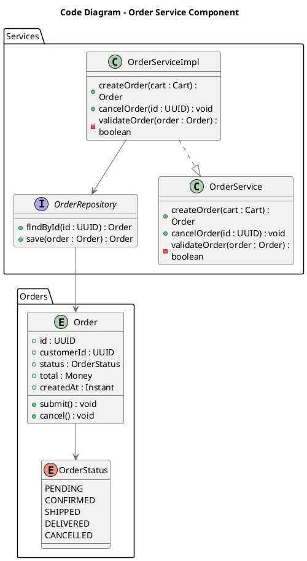

# Code Diagram (C4 Model Level 4)

## Description

A code diagram zooms into a single component to show how it is implemented as code — classes, interfaces, functions, database tables, and their relationships. This is the most zoomed-in view in the C4 model hierarchy.

In practice, code diagrams use **UML class diagrams**, entity relationship diagrams, or similar notation. The C4 model does not prescribe a strict visual language for this level — use the notation that best fits your implementation paradigm (OOP classes, functional modules, database schemas, etc.).

This level of detail is **optional** and best generated automatically by tooling (IDEs, UML modelling tools). Manual maintenance is rarely justified for long-lived documentation.

## Utility

| Aspect | Purpose |
|--------|---------|
| **Implementation clarity** | Show exactly how a complex component is structured internally |
| **Design documentation** | Record key abstractions, patterns, and relationships for future reference |
| **Onboarding** | Help new developers understand the internal structure of critical code |
| **Code generation** | Serve as a blueprint for code-first or model-first development |
| **Review support** | Highlight the intended design so reviewers can detect drift from the plan |

## Scope

- **Scope:** A single component.
- **Primary elements:** Code elements within the component in scope — classes, interfaces, objects, functions, database tables, etc.
- **Supporting elements:** Elements from other components of the same container that the code interacts with (shown to provide context).
- **Out of scope:** Containers, deployment infrastructure, external system interactions at the API/network level.

## Primary Elements

Code elements inside the component being described:

- **Classes** — concrete implementation classes
- **Interfaces / Abstract classes** — contracts and extension points
- **Enumerations** — fixed sets of values
- **Functions / Methods** — key operations (show only those needed to tell the story)
- **Entities / Database tables** — persistent data structures
- **Modules / Packages** — grouping structures (shown as boundaries)

## Intended Audience

Software architects and developers working on the component.

## Recommended Usage

> *No, a code diagram is not recommended for long-lived documentation because most IDEs can generate this level of detail on demand.*
> — C4 Model official recommendation

Use a code diagram **selectively**:

- **New or complex components** — where the internal design is non-trivial and benefits from up-front clarity.
- **Design documentation** — to document key patterns, abstractions, and extension points before implementation starts.
- **Model-first development** — where code is generated from the diagram (UML MDL, JPA entities, etc.).

Do **not** create code diagrams for every component. Most code details are better explored in the IDE.

## How to Use It Correctly

### Do

- Show **only the elements that tell the story** — omit getters, setters, utility methods.
- Use **interfaces/abstract classes** to document extension points.
- Include **key relationships** (inheritance, association, composition, dependency).
- Annotate with **design patterns** where applicable (e.g. `<<Strategy>>`, `<<Factory>>`).
- Group related elements using **package/namespace boundaries**.
- Add **stereotypes** to clarify roles (`<<Entity>>`, `<<Service>>`, `<<Repository>>`).
- Generate the diagram from code when possible (IDE plugins, `plantuml-class-diagram` generators).

### Don't

- Don't diagram trivial components — a CRUD repository with one method adds no value.
- Don't show every private method and field — the diagram becomes noise.
- Don't maintain code diagrams by hand for long-lived documentation — they drift.
- Don't invent a non-standard notation — use UML class diagram conventions or ER diagrams.
- Don't include container-level or system-level elements inside the code diagram.

### Common Pitfalls

| Pitfall | Why It's Wrong | Fix |
|---------|----------------|-----|
| Hand-maintained for every component | Guaranteed drift — nobody updates these after initial creation | Generate from code or limit to critical components only |
| Full class dump (all getters/setters) | The diagram conveys no architectural information | Show only public API, key fields, and design-relevant methods |
| Missing stereotypes or patterns | The reader cannot tell a Service from an Entity | Use UML stereotypes and design-pattern annotations |
| Multiple components on one diagram | Violates the single-component scope | Split into one diagram per component |
| Drawing network boundaries / containers | Mixes code level with container level | Remove — reference the parent component/container in the title only |

## PlantUML Implementation

Code diagrams do **not** have a dedicated C4-PlantUML include file (`C4_Code.puml` does not exist in the stdlib). Instead, they use **native PlantUML class diagram syntax**.

You may optionally include `C4_Component.puml` to reference the parent component as context, but the code-level detail uses PlantUML's built-in class, interface, enum, and entity notation.

### Include

```plantuml
' Optional: include C4 component context
!include <C4/C4_Component>
```

### Class Diagram Macros Reference

| PlantUML Keyword | Purpose | Example |
|------------------|---------|---------|
| `class Alias` | A concrete class | `class OrderService` |
| `interface Alias` | An interface/contract | `interface PaymentGateway` |
| `abstract Alias` / `abstract class Alias` | An abstract class | `abstract class BaseRepository` |
| `enum Alias` | An enumeration | `enum OrderStatus` |
| `entity Alias` | A database entity / table | `entity Order` |
| `package Alias { ... }` | A namespace / package boundary | `package "Services" { ... }` |
| `together { ... }` | Keep related elements close | `together { ... }` |
| `namespace Alias { ... }` | A namespace boundary (UML package) | `namespace "com.example" { ... }` |

### Relationship Macros Reference

| Syntax | Relationship | Line |
|--------|--------------|------|
| `|--` | Inheritance / Realization | Solid line, empty triangle |
| `..|>` | Interface realization | Dashed line, empty triangle |
| `*--` | Composition | Solid line, filled diamond |
| `o--` | Aggregation | Solid line, empty diamond |
| `-->` | Association / Dependency | Solid line, arrow |
| `..>` | Dependency (dashed) | Dashed line, arrow |
| `--` | Direct link (no semantic) | Solid line |
| `..` | Dashed link (no semantic) | Dashed line |
| `+` before member | Public visibility | Prefix |
| `-` before member | Private visibility | Prefix |
| `#` before member | Protected visibility | Prefix |
| `~` before member | Package visibility | Prefix |

### Field / Method Syntax

```
{visibility}{static}{abstract}{fieldName} : {type}
{visibility}{static}{abstract}{methodName}({params}) : {returnType}
```

With optional stereotype:

```
<< stereotype >>
```

### Layout Options

| Directive | Effect |
|-----------|--------|
| `hide empty members` | Suppress empty member sections |
| `hide circle` | Hide the circle character on class members |
| `skinparam classAttributeIconSize 0` | Remove visibility icon circles |
| `left to right direction` | Horizontal layout instead of top-to-bottom |
| `LAYOUT_TOP_DOWN()` (C4) | C4-style top-down layout (requires C4 include) |
| `LAYOUT_WITH_LEGEND()` (C4) | C4-style legend — use with caution: shows C4 stereotypes (Person, Container, Component) irrelevant to class diagrams. Prefer omitting it for code-level diagrams. |
| `SHOW_LEGEND()` (C4) | Force legend display — same caveat as `LAYOUT_WITH_LEGEND()` |
| `HIDE_STEREOTYPE()` (C4) | Suppress C4 stereotypes (use if C4 include adds unwanted labels) |
| `together { ... }` | Force related elements to stay visually together |

### Complete Minimal Example



## Example Diagrams

See the [examples/](./examples/) directory for full worked examples:

- `code-ecommerce-order.puml` — Order processing service with strategy pattern
- `code-payment-service.puml` — Payment gateway component with multiple providers
- `code-healthcare-fhir.puml` — FHIR resource entity model
- `code-user-auth.puml` — Authentication component class hierarchy

## Review Checklist

Before validating a code diagram, run the [C4 Diagram Review Checklist](../checklist.md). Items marked `[CODE]` or `[ALL]` apply. Pay special attention to scope discipline (single component), element selection (show only the story), and drift risk (hand-maintained diagrams).
