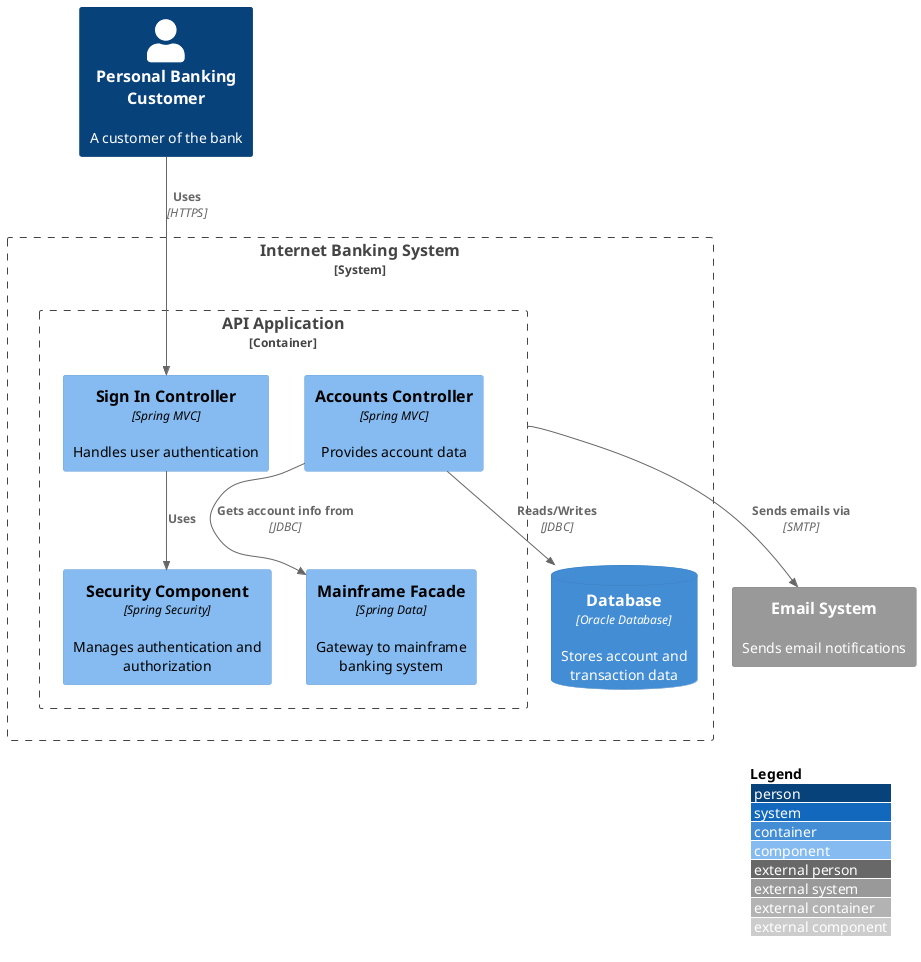

# Component Diagram (C4 Model Level 3)

## Description

A component diagram zooms into a single container to show its **internal structure**: the components that reside inside it, their responsibilities, and the technology/implementation details. In C4, a *component* is a grouping of related functionality — a module, a service, a controller, a repository, etc.

This diagram bridges the gap between the high-level container shape and the low-level code. It is the last C4 level before reaching actual code (UML class diagrams).

## Utility

| Aspect | Purpose |
|--------|---------|
| **Internal structure** | Expose how a container is decomposed into smaller units of functionality |
| **Responsibility mapping** | Show which component owns which feature or data |
| **Technology detail** | Document frameworks, patterns, and libraries used inside a container |
| **Interface clarity** | Make component boundaries and their relationships explicit |
| **Onboarding** | Help developers understand the internal architecture before reading code |

## Scope

- **Scope:** A single container.
- **Primary elements:** Components within the container in scope.
- **Supporting elements:** Containers (within the same software system) plus people and software systems directly connected to the components. These are typically imported from the parent container diagram.
- **Out of scope:** Internal classes, objects, database tables, functions (these belong in the code diagram at level 4). Deployment topology and environment details.

## Primary Elements

Components — the modules, services, controllers, repositories, or other logical groupings of functionality inside the container.

## Supporting Elements

- **Containers:** Other containers within the same software system that the components interact with (databases, message queues, other services).
- **People:** Users or roles who interact directly with the components.
- **Software systems:** External systems the components depend on.

## Intended Audience

Software architects and developers.

## Recommended Usage

> *No, a component diagram is not recommended for long-lived documentation. Only create one if you feel it adds value, and consider automating its creation.*
> — C4 Model official recommendation

Use a component diagram **selectively**:

- **Complex containers** — where the internal decomposition is non-trivial and deserves explicit documentation.
- **New development** — as a blueprint before implementation.
- **Architecture reviews** — to validate component boundaries and dependencies.
- **Automated generation** — derive from code using reflection or static analysis to avoid drift.

Do **not** create component diagrams for every container — most are simple enough that the container diagram and code are sufficient.

## How to Use It Correctly

### Do

- Represent the container with `Container_Boundary` and place **all components** inside it. Do not add a separate `Container(...)` element — the boundary itself serves as the container.
- Label each component with its **technology** (framework, language, library).
- Include **supporting elements** from the container diagram so the reader sees the full picture.
- Draw **relationships** between components and to containers/people/systems outside.
- Use `ComponentDb` for components backed by persistent storage, `ComponentQueue` for message-handling components.
- Keep the diagram **up to date** or automate it — component diagrams drift faster than any other C4 level.

### Don't

- Don't decompose into **classes or database tables** — that is code level (level 4).
- Don't show **deployment details** (cluster nodes, replicas, ports).
- Don't include **every component** if the container has dozens — group related components or limit to important ones.
- Don't omit **technology labels** — the value of a component diagram is in showing how things are built.

### Common Pitfalls

| Pitfall | Why It's Wrong | Fix |
|---------|----------------|-----|
| Showing classes instead of components | Violates the C4 level boundary — classes are level 4 | Group classes into logical components |
| Missing technology labels | The diagram shows *what* but not *how* | Always add the `$techn` parameter |
| Ignoring supporting containers | Components appear disconnected from their runtime context | Include the databases, queues, and external containers they talk to |
| Hand-maintained without automation | Drift is guaranteed in any non-trivial codebase | Derive from code or limit to stable, high-value areas |
| One component does everything | No architectural insight — it is a "god component" | Split into focused, single-responsibility components |

## Notes

Component diagrams are the most common level to let drift. If you find that a component diagram is consistently out of date, consider:

- Generating it from source code annotations or reflection.
- Removing it and relying on the container diagram + code instead.
- Using it only as a temporary design tool (throwaway after implementation).

## PlantUML Implementation

Component diagrams use the C4-PlantUML library via `C4_Component.puml`, which extends `C4_Container.puml`.

### Include

```plantuml
!include <C4/C4_Component>
```

Or from the GitHub source:

```plantuml
!include https://raw.githubusercontent.com/plantuml-stdlib/C4-PlantUML/master/C4_Component.puml
```

### Macros Reference

| Macro | Purpose | Parameters |
|-------|---------|------------|
| `Component(alias, label, techn, ?descr, ?sprite, ?tags, ?link)` | A component inside the container | `alias`, `label`, `techn` (technology) |
| `ComponentDb(alias, label, techn, ?descr, ...)` | A component backed by a database | Same as `Component` |
| `ComponentQueue(alias, label, techn, ?descr, ...)` | A message-handling component | Same as `Component` |
| `Component_Ext(alias, label, techn, ...)` | A component external to the scope | Same as `Component` |
| `ComponentDb_Ext(alias, label, techn, ...)` | External component with database shape | Same as `ComponentDb` |
| `ComponentQueue_Ext(alias, label, techn, ...)` | External component with queue shape | Same as `ComponentQueue` |
| `Container_Boundary(alias, label, ...)` | Represents the container and groups its components. In component diagrams, this is the container's visual representation — do NOT add a separate `Container(...)` element alongside it. | `alias`, `label` |
| `Container(alias, label, techn, ?descr, ...)` | A container (imported from C4_Container) | `alias`, `label`, `techn` |
| `ContainerDb(alias, label, techn, ...)` | A data store container | Same as `Container` |
| `ContainerQueue(alias, label, techn, ...)` | A message queue container | Same as `Container` |
| `System_Boundary(alias, label, ...)` | System scope boundary (imported) | `alias`, `label` |
| `Person(alias, label, ?descr, ...)` | A human user (imported) | `alias`, `label` |
| `Person_Ext(alias, label, ...)` | Person external to the enterprise | Same as `Person` |
| `System(alias, label, ?descr, ...)` | A software system (imported) | `alias`, `label` |
| `System_Ext(alias, label, ...)` | External software system | Same as `System` |
| `Rel(from, to, label, ?techn, ...)` | A relationship | `from`, `to`, `label` |
| `Rel_U` / `Rel_D` / `Rel_L` / `Rel_R(...)` | Directional relationship variants | Same as `Rel` |
| `BiRel(from, to, label, ...)` | Bidirectional relationship | Same as `Rel` |

### Layout Options

| Macro | Effect |
|-------|--------|
| `LAYOUT_TOP_DOWN()` | Top-to-bottom layout (default) |
| `LAYOUT_LEFT_RIGHT()` | Left-to-right layout |
| `LAYOUT_WITH_LEGEND()` | Append a legend to the diagram |
| `SHOW_LEGEND()` | Display the legend only (use with explicit layout) |
| `HIDE_STEREOTYPE()` | Suppress the `<<stereotype>>` labels |
| `SHOW_PERSON_SPRITE()` / `HIDE_PERSON_SPRITE()` | Toggle person sprite |

### Complete Minimal Example



## Example Diagrams

See the [examples/](./examples/) directory for full worked examples:

- `component-ecommerce.puml` — E-commerce API container with controllers, services, and repositories
- `component-payment.puml` — Payment processing container with anti-corruption layer and gateways
- `component-healthcare.puml` — FHIR API container with resource handlers, validation, and persistence
- `component-notification.puml` — Notification service with channel dispatch, templates, and delivery

## Review Checklist

Before validating a component diagram, run the [C4 Diagram Review Checklist](../checklist.md). Items marked `[COMP]` or `[ALL]` apply. Pay special attention to the single-container scope, component-level abstraction (not classes), and technology labels.
