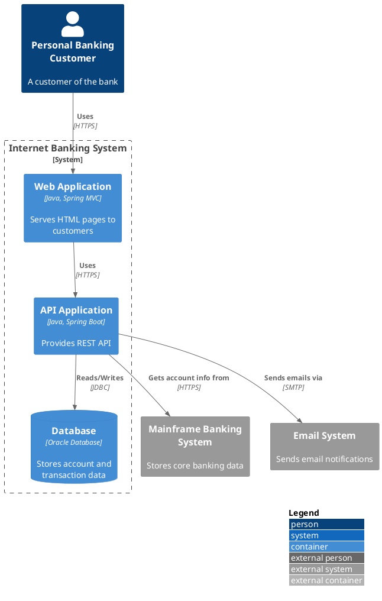

# Container Diagram (C4 Model Level 2)

## Description

A container diagram zooms into a single software system to show its **high-level shape**: the applications and data stores (containers) that make up the system, how responsibilities are distributed across them, and how they communicate.

In C4, a *container* is not a Docker container. It is any application or data store: a server-side web app, a single-page application, a mobile app, a database schema, a file system folder, an S3 bucket, etc.

This diagram is technology-focused and useful for **software developers and operations/support staff**.

## Utility

| Aspect | Purpose |
|--------|---------|
| **Architecture visibility** | Reveal the internal structure of a system at a high level |
| **Technology decisions** | Document the major technology choices (frameworks, databases, etc.) |
| **Responsibility mapping** | Show which container owns which responsibility |
| **Communication patterns** | Make inter-container communication (REST, messaging, files) explicit |
| **Onboarding** | Give developers a clear picture of what runs where |

## Scope

- **Scope:** A single software system.
- **Primary elements:** Containers within the software system in scope.
- **Supporting elements:** People and software systems directly connected to the containers.
- **Out of scope:** Internal component decomposition, deployment topology (clustering, load balancers, replication, failover — these belong in deployment diagrams).

## Primary Elements

Containers — the applications and data stores that execute or store data within the software system boundary.

## Supporting Elements

- **People:** Users, actors, roles, or personas who interact with the containers.
- **Software systems:** External systems the containers depend on or integrate with.

## Intended Audience

Technical people inside and outside the software development team: software architects, developers, and operations/support staff.

## Recommended Usage

> *Yes, a container diagram is recommended for all software development teams.*
> — C4 Model official recommendation

Create it after the system context diagram. Keep it stable — update only when containers or their technology choices change.

## How to Use It Correctly

### Do

- Show **every container** that runs or stores data (web apps, mobile apps, databases, message queues, file stores).
- Label each container with its **technology** (e.g. "ASP.NET Core", "React", "PostgreSQL", "RabbitMQ").
- Show **inter-container communication** with protocol labels (e.g. "HTTPS", "AMQP", "JDBC").
- Distinguish **application** containers from **data store** containers visually (use `ContainerDb` for databases).
- Include the **external people and systems** from the context diagram so the reader sees the full picture.
- Use `System_Boundary` to group containers that belong inside the same software system.

### Don't

- Don't show **internal components** or classes — that's level 3 (component diagram).
- Don't include **deployment details** like clustering, replicas, load balancers, ports, or IP addresses.
- Don't draw **every environment separately** on the same diagram — create one container diagram per environment or use deployment diagrams.

### Common Pitfalls

| Pitfall | Why It's Wrong | Fix |
|---------|----------------|-----|
| Decomposing into microservices at container level | Each microservice should be its own system box at context level; container level shows what's inside ONE system | Keep the diagram focused on one software system |
| Drawing load balancers and replicas | Deployment details belong in deployment diagrams | Remove — note them in deployment diagrams instead |
| Mixing environments (dev, staging, prod) | A container diagram is environment-agnostic; deployment configuration varies | Create deployment diagrams per environment |
| Omitted technology labels | The container diagram's value is showing tech choices | Always add the `$techn` parameter to `Container()` |
| Including component-level classes or files | Too detailed for level 2 | Move to a component diagram (level 3) |

## Notes

A container diagram says very little about deployment aspects such as clustering, load balancers, replication, and failover because these vary across environments (production, staging, development). Capture deployment information in one or more deployment diagrams (one per environment).

## PlantUML Implementation

Container diagrams use the C4-PlantUML library via `C4_Container.puml`.

### Include

```plantuml
!include <C4/C4_Container>
```

Or from the GitHub source:

```plantuml
!include https://raw.githubusercontent.com/plantuml-stdlib/C4-PlantUML/master/C4_Container.puml
```

### Macros Reference

| Macro | Purpose | Parameters |
|-------|---------|------------|
| `Person(alias, label, ?descr, ...)` | A human user | `alias`, `label` |
| `Person_Ext(alias, label, ...)` | Person external to the enterprise | Same as `Person` |
| `System(alias, label, ?descr, ...)` | A software system | `alias`, `label` |
| `System_Ext(alias, label, ?descr, ...)` | External system outside the enterprise | Same as `System` |
| `SystemDb(alias, label, ?descr, ...)` | System with database shape | `alias`, `label` |
| `SystemDb_Ext(alias, label, ...)` | External system with database shape | Same as `SystemDb` |
| `SystemQueue(alias, label, ...)` | System with queue shape | `alias`, `label` |
| `SystemQueue_Ext(alias, label, ...)` | External system with queue shape | Same as `SystemQueue` |
| `Container(alias, label, techn, ?descr, ...)` | An application container | `alias`, `label`, `techn` (technology) |
| `ContainerDb(alias, label, techn, ?descr, ...)` | A data store container | `alias`, `label`, `techn` |
| `ContainerQueue(alias, label, techn, ?descr, ...)` | A message queue container | `alias`, `label`, `techn` |
| `Container_Ext(alias, label, techn, ...)` | An external container | Same as `Container` |
| `ContainerDb_Ext(alias, label, techn, ...)` | External data store | Same as `ContainerDb` |
| `ContainerQueue_Ext(alias, label, techn, ...)` | External queue | Same as `ContainerQueue` |
| `Container_Boundary(alias, label, ...)` | Grouping boundary for containers | `alias`, `label` |
| `System_Boundary(alias, label, ...)` | System scope boundary | `alias`, `label` |
| `Boundary(alias, label, ...)` | Generic boundary | `alias`, `label` |
| `Rel(from, to, label, ?techn, ...)` | A relationship | `from`, `to`, `label` |
| `Rel_U/Rel_D/Rel_L/Rel_R(...)` | Directional relationship | Same as `Rel` |
| `BiRel(from, to, label, ...)` | Bidirectional relationship | Same as `Rel` |

### Layout Options

| Macro | Effect |
|-------|--------|
| `LAYOUT_TOP_DOWN()` | Top-to-bottom layout (default) |
| `LAYOUT_LEFT_RIGHT()` | Left-to-right layout |
| `LAYOUT_WITH_LEGEND()` | Append a legend to the diagram |
| `SHOW_LEGEND()` | Display the legend only (use with explicit layout) |
| `HIDE_STEREOTYPE()` | Suppress the `<<stereotype>>` labels |
| `SHOW_PERSON_SPRITE()` / `HIDE_PERSON_SPRITE()` | Toggle person sprite |

### Complete Minimal Example



## Example Diagrams

See the [examples/](./examples/) directory for full worked examples:

- `container-ecommerce.puml` — E-commerce system containers (web SPA, API, database, queue)
- `container-healthcare.puml` — Healthcare platform containers (FHIR API, EHR DB, message bus)
- `container-microservices.puml` — Microservice-based system containers with API gateway
- `container-social-media.puml` — Social media platform containers (feed service, notification worker)

## Review Checklist

Before validating a container diagram, run the [C4 Diagram Review Checklist](../checklist.md). Items marked `[CONT]` or `[ALL]` apply. Pay special attention to technology labels and inter-container protocols.
