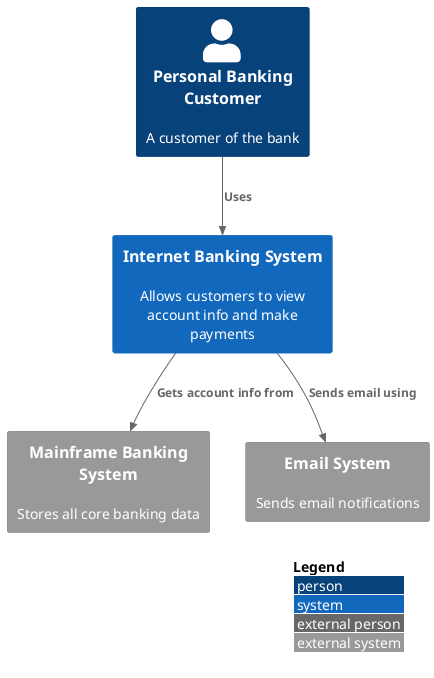

# System Context Diagram (C4 Model Level 1)

## Description

A system context diagram shows the **big picture** of a software system: the system itself as a single box in the center, surrounded by its users (people) and the other systems it interacts with. It is the most zoomed-out view of the C4 model hierarchy.

This is the diagram you show to **non-technical stakeholders**. Details like technology, protocols, and internal structure are deliberately omitted.

## Utility

| Aspect | Purpose |
|--------|---------|
| **Communication** | Align technical and non-technical audiences on system scope |
| **Boundary clarity** | Make explicit what is *in scope* vs *out of scope* |
| **Dependency mapping** | Identify all external systems the software depends on |
| **Onboarding** | Give new team members a one-page overview of the system landscape |
| **Risk analysis** | Surface external dependencies that could become failure points |

## Scope

- **Scope:** A single software system.
- **Primary elements:** The software system in scope.
- **Supporting elements:** People (users, actors, roles, personas) and external software systems directly connected to the system in scope.
- **Out of scope:** Internal containers, components, code, infrastructure details, protocols, technologies.

## Primary Elements

The software system being described or designed — shown as a single box in the center.

## Supporting Elements

- **People:** Users, actors, roles, or personas who interact with the system.
- **Software systems:** External systems the system depends on or integrates with. These are typically outside your ownership or control.

## Intended Audience

Everybody — technical and non-technical, inside and outside the development team.

## Recommended Usage

> *Yes, a system context diagram is recommended for all software development teams.*
> — C4 Model official recommendation

Use it at project start, during onboarding, in architecture reviews, and whenever the system boundary shifts.

## How to Use It Correctly

### Do

- Keep it **high-level**: one box for your system, one box per external dependency.
- Show **people** as stick-figure icons, systems as rectangle boxes.
- Label relationships with a short verb describing the interaction (e.g. "Uses", "Sends orders to").
- Include a legend explaining the notation.
- Use the diagram as a **communication tool**, not a technical specification.

### Don't

- Don't show internal containers, components, or databases.
- Don't include technologies, protocols, or ports.
- Don't draw every possible user role — group by persona.
- Don't add implementation detail — this is a "what", not a "how" diagram.
- Don't show readmes, docs, or non-technical project assets as software systems.

### Common Pitfalls

| Pitfall | Why It's Wrong | Fix |
|---------|----------------|-----|
| Showing databases | Too detailed for level 1 | Replace with the system that owns the DB |
| Showing every microservice | Violates the single-system scope | Group into one system box |
| Omitting external dependencies | Hides integration risk | Add every system you call or that calls you |
| Unlabeled relationships | The diagram loses meaning | Always label edges with a verb |
| Mixing levels | Confuses the audience | Keep strictly to system-level elements only |

## PlantUML Implementation

System context diagrams use the C4-PlantUML library via `C4_Context.puml`.

### Include

```plantuml
!include <C4/C4_Context>
```

Or from the GitHub source:

```plantuml
!include https://raw.githubusercontent.com/plantuml-stdlib/C4-PlantUML/master/C4_Context.puml
```

### Macros Reference

| Macro | Purpose | Parameters |
|-------|---------|------------|
| `Person(alias, label, ?descr, ?sprite, ?tags, ?link, ?type)` | A human user | `alias` (required), `label` (required) |
| `Person_Ext(alias, label, ...)` | A person external to the enterprise | Same as `Person` |
| `System(alias, label, ?descr, ...)` | The software system in scope or a dependency | `alias` (required), `label` (required) |
| `System_Ext(alias, label, ?descr, ...)` | An external software system | Same as `System` |
| `SystemDb(alias, label, ?descr, ...)` | A system backed by a database shape | Same as `System` |
| `SystemQueue(alias, label, ?descr, ...)` | A system with a queue shape | Same as `System` |
| `Boundary(alias, label, ?type, ...)` | An arbitrary grouping boundary | `alias`, `label` |
| `Enterprise_Boundary(alias, label, ...)` | Enterprise ownership boundary | `alias`, `label` |
| `System_Boundary(alias, label, ...)` | System scope boundary | `alias`, `label` |
| `Rel(from, to, label, ?techn, ...)` | A relationship between two elements | `from`, `to`, `label` |
| `Rel_U/Rel_D/Rel_L/Rel_R(...)` | Directional relationship variants | Same as `Rel` |
| `BiRel(from, to, label, ...)` | Bidirectional relationship | Same as `Rel` |

### Layout Options

| Macro | Effect |
|-------|--------|
| `LAYOUT_TOP_DOWN()` | Top-to-bottom layout (default) |
| `LAYOUT_LEFT_RIGHT()` | Left-to-right layout |
| `LAYOUT_WITH_LEGEND()` | Append a legend to the diagram |
| `SHOW_LEGEND()` | Display the legend (more control) |
| `HIDE_STEREOTYPE()` | Suppress the `<<stereotype>>` labels |
| `HIDE_PERSON_SPRITE()` | Hide person stick-figure sprite |

### Complete Minimal Example



## Example Diagrams

See the [examples/](./examples/) directory for full worked examples:

- `example-ecommerce.puml` — E-commerce platform with customers, payment gateway, and logistics
- `example-healthcare.puml` — Healthcare system with patients, practitioners, and insurance
- `example-saas.puml` — SaaS platform with tenants, billing, and monitoring
- `example-system-landscape.puml` — Multi-system landscape view

## Review Checklist

Before validating a system context diagram, run the [C4 Diagram Review Checklist](../checklist.md). Items marked `[CTX]` or `[ALL]` apply. Pay special attention to scope, boundaries, and external system identification.
